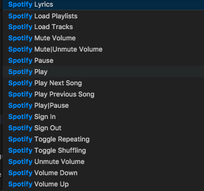

[](https://marketplace.visualstudio.com/items?itemName=shyykoserhiy.vscode-spotify)
[](https://marketplace.visualstudio.com/items?itemName=shyykoserhiy.vscode-spotify)
[](https://marketplace.visualstudio.com/items?itemName=shyykoserhiy.vscode-spotify#review-details)

# vscode-spotify

[](#contributors)

Use Spotify inside vscode.
Provides integration with Spotify Desktop client. 

Note that some of the functionalities are only available on macOS systems (see [How it works section](#how-it-works))

**This extension requires Spotify Premium to work on Windows**

## How it works

* On macOS, this extension uses [spotify-node-applescript](https://github.com/andrehaveman/spotify-node-applescript) (basically a wrapper for the official Spotify AppleScript API) to communicate with Spotify.
* On Windows, it extension uses the Spotify Web API. 
* On Linux, it uses a combination of dbus and pactl.

Spotify Web API implementation can be used on any platform, but it does have some drawbacks:
* It doesn't work without internet connection (Linux and OS X implementations do).
* Full functionality is only available to Spotify Premium users. 
* API calls are rate limited.

At the same time it provides tighter integration and it's more or less future proofed.

## Features
* Shows the currently playing song in the vscode status bar.

* Provides [commands](#commands) for controlling Spotify from vscode. 
* Provides [hotkeys](#Adding%20or%20changing%20hotkeys) of commands.
* Provides [buttons](#buttons) for controlling Spotify from vscode.

## Compatibility table

| Feature                      | macOS         | Linux                        | Any Platform (only option on Windows) Web API |
| ---------------------------- |:-------------:| :--------------------------- | :-------------------------------------------- |
| Works Offline                | ✅            | ✅                            | ❌                                            |
| Show Current Song            | ✅            | ✅                            | ✅                                            |
| Play Next Song               | ✅            | ✅                            | ✅                                            |
| Play Previous Song           | ✅            | ✅                            | ✅                                            |
| Play                         | ✅            | ✅                            | ✅                                            |
| Pause                        | ✅            | ✅                            | ✅                                            |
| Play Pause                   | ✅            | ✅                            | ✅                                            |
| Mute Volume                  | ✅            | ✅                            | ✅                                            |
| Unmute Volume                | ✅            | ✅                            | ✅                                            |
| Mute Unmute Volume           | ✅            | ✅                            | ✅                                            |
| Volume Up                    | ✅            | ✅                            | ✅                                            |
| Volume Down                  | ✅            | ✅                            | ✅                                            |
| Toggle Repeating             | ✅            | (shows repeating state)  ⭕   | ✅             				    |
| Toggle Shuffling             | ✅            | (shows shuffling state)  ⭕   | ✅                                            |
| Lyrics                       | ✅            | ✅                            | ✅                                            |

Additional Web API features
* Playlists/tracks selection. *Make sure you have logged in with the command `>Spotify Sign In` to use these features. You can open the Virtual Studio Code command line with the hotkey `Ctrl+P` by default.*

## Contributing 
This project follows the
[all-contributors](https://github.com/kentcdodds/all-contributors)
specification. Contributions of any kind are welcome, any contributions made will be recognised in the README.

A list of contributors to this project
([emoji key](https://github.com/kentcdodds/all-contributors#emoji-key)):

<!-- ALL-CONTRIBUTORS-LIST:START - Do not remove or modify this section -->
<!-- prettier-ignore -->
| [<br /><sub><b>shyyko.serhiy</b></sub>](https://github.com/ShyykoSerhiy)<br />[💻](https://github.com/ShyykoSerhiy/vscode-spotify/commits?author=ShyykoSerhiy "Code") [🎨](#design-ShyykoSerhiy "Design") [📖](https://github.com/ShyykoSerhiy/vscode-spotify/commits?author=ShyykoSerhiy "Documentation") [🤔](#ideas-ShyykoSerhiy "Ideas, Planning, & Feedback") [👀](#review-ShyykoSerhiy "Reviewed Pull Requests") | [<br /><sub><b>Levin Rickert</b></sub>](https://www.levrik.io)<br />[🐛](https://github.com/ShyykoSerhiy/vscode-spotify/issues?q=author%3Alevrik "Bug reports") [💻](https://github.com/ShyykoSerhiy/vscode-spotify/commits?author=levrik "Code") | [<br /><sub><b>Marc Riera</b></sub>](https://github.com/mrcasals)<br />[💻](https://github.com/ShyykoSerhiy/vscode-spotify/commits?author=mrcasals "Code") | [<br /><sub><b>Evan Brodie</b></sub>](https://github.com/ecbrodie)<br />[💻](https://github.com/ShyykoSerhiy/vscode-spotify/commits?author=ecbrodie "Code") [🐛](https://github.com/ShyykoSerhiy/vscode-spotify/issues?q=author%3Aecbrodie "Bug reports") | [<br /><sub><b>Stéphane</b></sub>](https://github.com/Stephanyan)<br />[📖](https://github.com/ShyykoSerhiy/vscode-spotify/commits?author=Stephanyan "Documentation") | [<br /><sub><b>Ryan Gordon</b></sub>](https://github.com/Ryan-Gordon)<br />[📖](https://github.com/ShyykoSerhiy/vscode-spotify/commits?author=Ryan-Gordon "Documentation") [🤔](#ideas-Ryan-Gordon "Ideas, Planning, & Feedback") | [<br /><sub><b>Richard Stanley</b></sub>](http://www.audstanley.com)<br />[💻](https://github.com/ShyykoSerhiy/vscode-spotify/commits?author=audstanley "Code") |
| :---: | :---: | :---: | :---: | :---: | :---: | :---: |
| [<br /><sub><b>realbizkit</b></sub>](https://github.com/realbizkit)<br />[💻](https://github.com/ShyykoSerhiy/vscode-spotify/commits?author=realbizkit "Code") | [<br /><sub><b>Jesús Roldán</b></sub>](http://jesusroldan.com)<br />[💻](https://github.com/ShyykoSerhiy/vscode-spotify/commits?author=xeBuz "Code") | [<br /><sub><b>Nicolás Gebauer</b></sub>](https://negebauer.com)<br />[💻](https://github.com/ShyykoSerhiy/vscode-spotify/commits?author=negebauer "Code") | [<br /><sub><b>Muhammad Rivki</b></sub>](http://this.rivki.id/)<br />[💻](https://github.com/ShyykoSerhiy/vscode-spotify/commits?author=mikqi "Code") | [<br /><sub><b>Mosh Feu</b></sub>](https://il.linkedin.com/in/moshefeuchtwanger)<br />[📖](https://github.com/ShyykoSerhiy/vscode-spotify/commits?author=moshfeu "Documentation") | [<br /><sub><b>Adam Parkin</b></sub>](https://www.codependentcodr.com)<br />[📖](https://github.com/ShyykoSerhiy/vscode-spotify/commits?author=pzelnip "Documentation") | [<br /><sub><b>Andrew Bastin</b></sub>](https://github.com/AndrewBastin)<br />[📖](https://github.com/ShyykoSerhiy/vscode-spotify/commits?author=AndrewBastin "Documentation") |
| [<br /><sub><b>Michael Fox</b></sub>](https://www.michaelscottfox.com)<br />[📖](https://github.com/ShyykoSerhiy/vscode-spotify/commits?author=misterfoxy "Documentation") |
<!-- ALL-CONTRIBUTORS-LIST:END -->

## Commands

There are a number of commands available for the extension, and accessible via the command
pallette.  Find them by searching for "Spotify" in the command pallette:



## Adding or changing hotkeys
All keyboard shortcuts in vscode can be customized via the `User/keybindings.json` file.

To configure keyboard shortcuts the way you want, go to the menu under File > Preferences > Keyboard Shortcuts.
This will open the Default Keyboard Shortcuts on the left and your `User/keybindings.json` file where you can overwrite the default bindings on the right. You may also see an interface to modify the shortcuts on different versions of vscode.

Example :
```json
{
		"command": "spotify.volumeDown",
		"key": "cmd+shift+g"
}
```

For more info on hotkeys please look at https://code.visualstudio.com/docs/customization/keybindings

## Buttons
This extension provides a variety of buttons to control Spotify from status bar. By default 4 buttons are enabled:
1. Previous track
2. Play / Pause
3. Next track
4. Mute / Unmute

You can modify the shown buttons by changing your parameters ([go here to find out how](https://code.visualstudio.com/docs/customization/userandworkspace)):
```json
"spotify.showNextButton": {
	"type": "boolean",
	"default": true,
	"description": "Whether to show next button."
},
"spotify.showPreviousButton": {
	"type": "boolean",
	"default": true,
	"description": "Whether to show previous button."
},
"spotify.showPlayButton": {
	"type": "boolean",
	"default": false,
	"description": "Whether to show play button."
},
"spotify.showPauseButton": {
	"type": "boolean",
	"default": false,
	"description": "Whether to show pause button."
},
"spotify.showPlayPauseButton": {
	"type": "boolean",
	"default": true,
	"description": "Whether to show play|pause button."
},
"spotify.showMuteVolumeButton": {
	"type": "boolean",
	"default": false,
	"description": "Whether to show mute button."
},
"spotify.showUnmuteVolumeButton": {
	"type": "boolean",
	"default": false,
	"description": "Whether to show unmute button."
},
"spotify.showMuteUnmuteVolumeButton": {
	"type": "boolean",
	"default": true,
	"description": "Whether to show mute|unmute button."
},
"spotify.showVolumeUpButton": {
	"type": "boolean",
	"default": false,
	"description": "Whether to show volume up button."
},
"spotify.showVolumeDownButton": {
	"type": "boolean",
	"default": false,
	"description": "Whether to show volume down button."
}
"spotify.showToggleRepeatingButton": {
	"type": "boolean",
	"default": false,
	"description": "Whether to show toggle repeating button."
},
"spotify.showToggleShufflingButton": {
	"type": "boolean",
	"default": false,
	"description": "Whether to show toggle shuffling button."
}
```

For the full configuration options go [here](https://github.com/ShyykoSerhiy/vscode-spotify/blob/master/package.json#L161).

Note that due to limitations of Spotify's Applescript API ```toggleRepeatingButton``` toggles only
'repeat all' property of spotify. There is no way to set 'repeat one' via vscode-spotify.  

You can also change the position of buttons by changing the parameters below:

```json
"spotify.priorityBase": {
	"type": "number",
	"default": 30,
	"description": "Base value of priority for all vscode-spotify elements in Status Bar(priority = basePriority+priority). This is done to avoid 'conflicts' with other extensions. "
},
"spotify.nextButtonPriority": {
	"type": "number",
	"default": 8,
	"description": "Priority of next button."
},
"spotify.previousButtonPriority": {
	"type": "number",
	"default": 10,
	"description": "Priority of previous button."
},
"spotify.playButtonPriority": {
	"type": "number",
	"default": 7,
	"description": "Priority of play button."
},
"spotify.pauseButtonPriority": {
	"type": "number",
	"default": 6,
	"description": "Priority of pause button."
},
"spotify.playPauseButtonPriority": {
	"type": "number",
	"default": 9,
	"description": "Priority of play|pause button."
},
"spotify.muteButtonPriority": {
	"type": "number",
	"default": 5,
	"description": "Priority of mute button."
},
"spotify.unmuteButtonPriority": {
	"type": "number",
	"default": 4,
	"description": "Priority of unmute button."
},
"spotify.muteUnmuteButtonPriority": {
	"type": "number",
	"default": 3,
	"description": "Priority of mute|unmute button."
},
"spotify.volumeUpButtonPriority": {
	"type": "number",
	"default": 2,
	"description": "Priority of volume up button."
},
"spotify.volumeDownButtonPriority": {
	"type": "number",
	"default": 1,
	"description": "Priority of volume down button."
},
"spotify.trackInfoPriority": {
	"type": "number",
	"default": 0,
	"description": "Priority of volume track info."
},
"spotify.toggleRepeatingButtonPriority": {
	"type": "number",
	"default": 11,
	"description": "Priority of toggle repeating button."
},
"spotify.toggleShufflingButtonPriority": {
	"type": "number",
	"default": 12,
	"description": "Priority of toggle shuffling button."
}
```

[MIT LICENSE](LICENSE)
